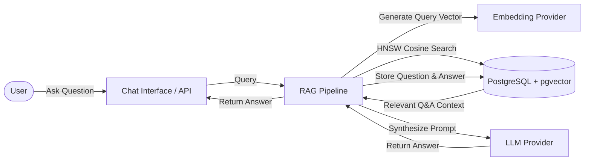

# Django RAGKit

📖 **Full Documentation**: [https://shahyadkashkouli.github.io/django-ragkit/](https://shahyadkashkouli.github.io/django-ragkit/)

---

## Overview

**Django RAGKit** is a reusable Django application designed to seamlessly integrate Retrieval-Augmented Generation (RAG) and intelligent conversational AI into any Django project.

Instead of orchestrating separate vector databases, external search clusters, or complex glue code, Django RAGKit stores all your vector embeddings directly inside your primary PostgreSQL database using the native **pgvector** extension. It provides vector indexing with HNSW cosine distance, modular provider adapters (OpenRouter and Ollama), automatic signals for real-time embedding synchronization, and a built-in interactive chat web interface.



---

## Key Features

- **Native PostgreSQL & pgvector**: Stores vector embeddings directly in PostgreSQL using `VectorField` backed by fast `HnswIndex` cosine distance operations (`vector_cosine_ops`).
- **Modular Provider Architecture**: Switch easily between local models (**Ollama**) and cloud endpoints (**OpenRouter**) without changing business logic.
- **Automated Embedding Synchronization**: Django signals (`post_save` and `pre_save`) automatically calculate and update vector embeddings whenever knowledge base items are added or modified.
- **Zero-Friction Embeddings Reset**: When changing embedding models or vector dimensions, run `python manage.py reset_embeddings` to safely back up existing tables, update column dimensions, and run migrations automatically.
- **Built-in Web Chat UI**: Ready-to-use modern chat UI with UUID session management, asynchronous messaging, and historical conversation viewing.
- **Configurable Access Control**: Toggle between guest-friendly access and authenticated-only mode using `LOGIN_REQUIRED`.

---

## Requirements

- **Python**: `>= 3`
- **Django**: `>= 5.2`
- **Database**: PostgreSQL 13+

---

## Installation & Quickstart (pip)

### 1. Install via pip

Install `django-ragkit` from PyPI. Core dependencies (`pgvector`, `psycopg2-binary`, `requests`, and `Django`) will be installed automatically:

```bash
pip install django-ragkit
```

---

### 2. Update `INSTALLED_APPS`

Add `django.contrib.postgres` and `django_ragkit` to your `INSTALLED_APPS` in `settings.py`:

```python
# settings.py

INSTALLED_APPS = [
    # Django standard apps...
    "django.contrib.admin",
    "django.contrib.auth",
    "django.contrib.contenttypes",
    "django.contrib.sessions",
    "django.contrib.messages",
    "django.contrib.staticfiles",

    # Required for vector search & Django RAGKit
    "django.contrib.postgres",
    "django_ragkit",
]
```

---

### 3. Configure `RAGKIT` Settings

Define the `RAGKIT` configuration dictionary in your `settings.py`:

```python
# settings.py

RAGKIT = {
    "EMBEDDING": {
        "PROVIDER": "openrouter",  # "openrouter" or "ollama"
        "MODEL": "baai/bge-m3",
        "BASE_URL": "https://openrouter.ai/api/v1",
        "DIMENSION": 1024,  # Exact dimension from model specs (not arbitrary, max 2000 for HNSW)
        "API_KEY": "your-embedding-api-key",
    },
    "LLM": {
        "PROVIDER": "openrouter",  # "openrouter" or "ollama"
        "MODEL": "nex-agi/nex-n2.5-mini:free",
        "BASE_URL": "https://openrouter.ai/api/v1",
        "API_KEY": "your-llm-api-key",
    },
}
```

---

### 4. Run Migrations

Run database migrations to initialize pgvector and create Django RAGKit's database tables:

```bash
python manage.py migrate
```

> [!TIP]
> **Automatic pgvector Extension**:
> Django RAGKit's initial migration automatically executes `VectorExtension()`, creating the PostgreSQL `vector` extension if it does not already exist.

> [!IMPORTANT]
> **Default Vector Dimension (1024)**:
> Django RAGKit's default database schema is configured for **1024 dimensions** (matched with models such as `baai/bge-m3`).
> 
> If you want to use an embedding model with a different dimension (e.g. `768` or `1536` — up to `2000`), set `"DIMENSION"` in `settings.py` and run:
> ```bash
> python manage.py reset_embeddings
> ```
> This command safely creates a backup, updates the table schema to your new dimension, and executes the migration automatically.

---

### 5. Include URL Routing

Include `django_ragkit.urls` in your project's root `urls.py`:

```python
# urls.py
from django.contrib import admin
from django.urls import path, include

urlpatterns = [
    path("admin/", admin.site.urls),
    path("", include("django_ragkit.urls")),  # Serves /chat/, /chat/<uuid>/, etc.
]
```

Or mount under a prefix:

```python
urlpatterns = [
    path("ragkit/", include("django_ragkit.urls")),  # Serves /ragkit/chat/, etc.
]
```

---

## Settings Reference

All settings are configured under the `RAGKIT` dictionary in `settings.py`.

### 1. `EMBEDDING` Configuration

Configures the provider responsible for vectorizing questions and queries.

| Parameter | Type | Required | Description |
| :--- | :--- | :--- | :--- |
| `PROVIDER` | `str` | Yes | Provider backend: `"openrouter"` or `"ollama"`. |
| `MODEL` | `str` | Yes | Model identifier (e.g. `"baai/bge-m3"`, `"nomic-embed-text"`). |
| `BASE_URL` | `str` | Yes | Base URL of the API endpoint (e.g. `"https://openrouter.ai/api/v1"` or `"http://localhost:11434"`). |
| `DIMENSION` | `int` | Yes | Dimensionality of the vector (e.g. `1024`, `768`, `1536`). **This value is not arbitrary and must be taken directly from your chosen embedding model's technical specifications.** Maximum allowed is `2000` due to HNSW indexing constraints. |
| `API_KEY` | `str` | Optional | API key (required for OpenRouter, optional for Ollama). |

> [!WARNING]
> **Exact Model Dimension Required**:
> The `DIMENSION` value is **not arbitrary**—it must strictly match the output vector length defined in your embedding model's documentation (for example, `baai/bge-m3` is `1024`, `nomic-embed-text` is `768`). In addition, the maximum dimension supported by PostgreSQL's HNSW index is **2000**.

---

### 2. `LLM` Configuration

Configures the generative language model for synthesizing responses.

| Parameter | Type | Required | Description |
| :--- | :--- | :--- | :--- |
| `PROVIDER` | `str` | Yes | Provider backend: `"openrouter"` or `"ollama"`. |
| `MODEL` | `str` | Yes | Model identifier (e.g. `"llama3.2"`, `"nex-agi/nex-n2.5-mini:free"`). |
| `BASE_URL` | `str` | Yes | Base URL of the inference endpoint. |
| `API_KEY` | `str` | Optional | API key for authentication (required for OpenRouter, optional for Ollama). |

---

## How to Use

### 1. Adding Knowledge to your Database

You can populate your knowledge base directly through the Django Admin:

1. Navigate to `/admin/` and open **Question Answers** under **Django RAGKit**.
2. Add question and answer pairs.

> [!TIP]
> **Automatic Vector Calculation**:
> When saving a `QuestionAnswer` record, Django signals automatically call the configured embedding provider, calculate the vector, and save it in the `QAEmbedding` table.

---

### 2. Using the Built-in Chat Interface

Visit the chat interface in your browser:
- `http://localhost:8000/chat/`

The chat interface includes:
- Automatic session generation using UUIDs (`/chat/create/`)
- Persistent chat history (`/chat/<uuid>/`)
- Asynchronous query processing (`/chat/<uuid>/handle-message`)

---

### 3. Changing Embedding Models or Dimensions

If you change the `DIMENSION` or switch to a different embedding model:

1. Update `DIMENSION` (and `MODEL`) in `settings.py`.
2. Run the `reset_embeddings` management command:

```bash
python manage.py reset_embeddings
```

This command will:
1. Safely back up the current `django_ragkit_qaembedding` table to an archive table (e.g., `qaembedding_backup_YYYYMMDD_XXXX`).
2. Drop and recreate the table with the new vector dimensions.
3. Automatically run `makemigrations` and `migrate`.

---

## Endpoints Summary

| Endpoint | Method | Description |
| :--- | :--- | :--- |
| `/chat/` | `GET` | Renders the chat interface. |
| `/chat/create/` | `POST` | Creates a new chat session and returns a JSON payload containing the `uuid`. |
| `/chat/<uuid:uuid>/` | `GET` | Renders conversation history for the specified session. |
| `/chat/<uuid:uuid>/handle-message` | `POST` | Processes a user query via RAG and returns a JSON answer. |

---

## Optional Configurations (Auth & Prompts)

Django RAGKit provides additional optional settings for access control (authentication) and prompt customization:

```python
# settings.py

RAGKIT = {
    # ... required EMBEDDING and LLM settings ...

    # Optional: Authentication settings (defaults to False if omitted)
    "BASE_SETTING": {
        "LOGIN_REQUIRED": True,  # Require authentication for chat interface and API
    },

    # Optional: Custom prompts and fallback response
    "LLM": {
        # ...
        "OPTIONS": {
            "BASE_PROMPT": (
                "You are an expert customer service assistant. "
                "Answer questions strictly based on the provided dataset."
            ),
            "NOT_FOUND_PROMPT": (
                "I apologize, but I could not find information about your question in our database. "
                "Please reach out to support@example.com."
            ),
        },
    },
}
```

### 1. Authentication (`BASE_SETTING`)

| Parameter | Type | Required | Default | Description |
| :--- | :--- | :--- | :--- | :--- |
| `LOGIN_REQUIRED` | `bool` | Optional | `False` | When `True`, unauthenticated users cannot access chat views or submit questions (HTML views redirect to login, API returns HTTP 401 Unauthorized). |

---

### 2. Custom Prompts (`LLM["OPTIONS"]`)

#### `BASE_PROMPT`
Overrides the default system prompt sent to the LLM during RAG generation.

- **Type**: `str` (Optional)
- **Default prompt**:
  ```text
  You are a friendly and helpful assistant.
  Answer the user's questions based on the provided context.
  Use a natural, conversational tone, as if you're talking to a friend.
  Keep your answers clear, concise, and easy to understand.
  If the answer is not available in the provided context, say so honestly.
  Respond using the same language as `user_question`.
  ```

#### `NOT_FOUND_PROMPT`
The canned fallback message returned immediately when no relevant knowledge base match is found or when the highest similarity score is **below 50%**.

- **Type**: `str` (Optional)
- **Default fallback response**:
  ```text
  Sorry, I couldn't find information about that. Please contact support for assistance.
  ```

---

## Documentation

For comprehensive guides, architectural deep-dives, Docker setups, and provider configurations, check out the official documentation:  
👉 **[https://shahyadkashkouli.github.io/django-ragkit/](https://shahyadkashkouli.github.io/django-ragkit/)**

---

## License

This project is licensed under the [MIT License](LICENSE).

<br>

<p align="center">
  <strong>Production-ready Retrieval-Augmented Generation (RAG) and AI Chat toolkit for Django with PostgreSQL & pgvector.</strong>
</p>

<p align="center">
  <a href="https://shahyadkashkouli.github.io/django-ragkit/"></a>
  <a href="https://pypi.org/project/django-ragkit/"></a>
  <a href="https://pypi.org/project/django-ragkit/"></a>
  <a href="https://pypi.org/project/django-ragkit/"></a>
  <a href="https://github.com/shahyadKashkouli/django-ragkit/blob/main/LICENSE"></a>
</p>
