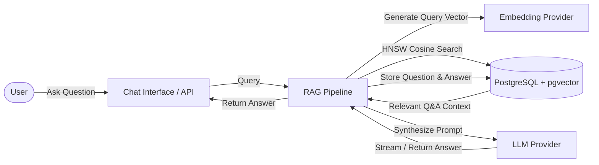

# Django RAGKit

  <strong>Production-ready Retrieval-Augmented Generation (RAG) and AI Chat toolkit for Django with PostgreSQL & pgvector.</strong>

---

## What is Django RAGKit?

**Django RAGKit** is a batteries-included Django application designed to easily integrate Retrieval-Augmented Generation (RAG) and intelligent conversational AI into any Django project.

Rather than stitching together separate vector databases, external orchestrators, and custom API glue code, Django RAGKit keeps your data and knowledge base directly in your primary PostgreSQL database using the native **pgvector** extension. It provides everything from vector storage and HNSW cosine indexing to modular LLM/Embedding providers, automatic signals for embedding synchronization, and a built-in interactive chat interface.

---

## Key Features

- **Native pgvector Integration**: Stores embeddings directly in PostgreSQL using `VectorField` and accelerated by `HnswIndex` with cosine distance operations (`vector_cosine_ops`).
- **Modular Provider Architecture**: Switch between local models (**Ollama**) and cloud endpoints (**OpenRouter**) without altering business logic. Easily extensible for custom providers.
- **Automated Embedding Synchronization**: Django signals (`post_save` and `pre_save`) automatically compute embeddings when new Q&A items are added or updated in the admin panel or database.
- **Zero-Friction Embeddings Reset**: Changing embedding models or dimensions? The `python manage.py reset_embeddings` command safely backs up existing tables, updates schema definitions, and executes migrations automatically.
- **Built-in Modern Web Chat UI**: Ready-to-use interactive chat interface with session management via UUIDs, async message handling, and feedback logging.
- **Flexible Access Control**: Toggle between guest-friendly chat and authenticated-only mode using built-in view mixins (`RagkitLoginRequiredMixin`, `RagkitApiLoginRequiredMixin`).

---

## Quick Navigation

| Section | Description |
| :--- | :--- |
| [Python Package (pip)](getting-started/installation.md) | Integrate into an existing Django project via pip |
| [Docker Quickstart](getting-started/docker.md) | One-line installer and automated environment configuration |
| [Docker Image](getting-started/docker-image.md) | Official pre-built Docker Hub image (`shincuff/django-ragkit:latest`) |
| [Settings Reference](configuration/settings.md) | Complete documentation of all `RAGKIT` configuration keys |
| [RAG Pipeline Architecture](architecture/pipeline.md) | Detailed walkthrough of the retrieval and generation lifecycle |
| [Reset Embeddings Command](operations/reset-embeddings.md) | Guide to schema migration when altering vector dimensions |

---

## License

Django RAGKit is open-source software licensed under the MIT License.
