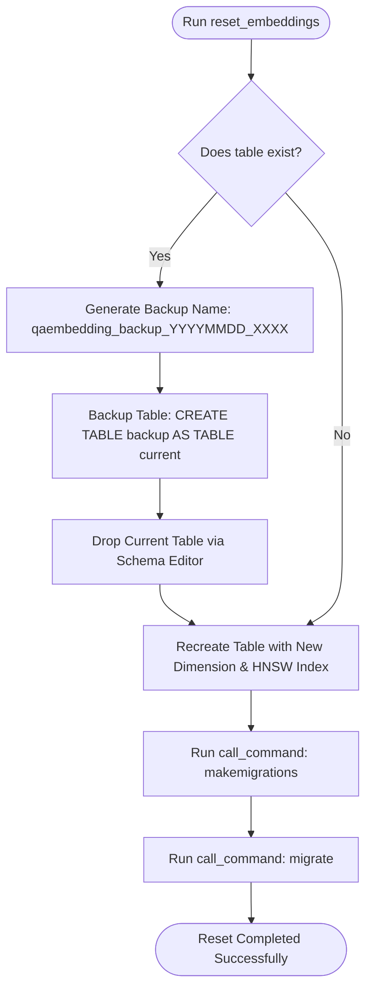

# Reset Embeddings Command

Django RAGKit provides an automated management command to safely reset and rebuild your vector embeddings table whenever you change embedding models or dimension sizes.

```bash
python manage.py reset_embeddings
```

---

## Why is this Command Necessary?

When building RAG systems, you will occasionally switch embedding models to improve retrieval quality or reduce latency (for example, switching from `baai/bge-m3` with 1024 dimensions to `nomic-embed-text` with 768 dimensions).

Switching embedding models introduces two technical challenges:

1. **PostgreSQL Column Type Constraints**:
   In PostgreSQL, pgvector columns are strictly typed to a specific dimensionality (e.g., `vector(1024)`). PostgreSQL cannot store vectors of different sizes in the same column, and altering the column dimension in-place is disallowed when HNSW indexes exist.
2. **Mathematical Incompatibility**:
   Vectors produced by different models occupy completely different latent spaces. A 1024-dimension vector from model A cannot be compared against a vector from model B. Existing vectors must be replaced.

---

## Command Lifecycle & Safety Mechanisms

The `reset_embeddings` command performs atomic operations inside a database transaction:



### 1. Zero Data Loss Archival
Before altering any tables, the command creates a standalone archival table:
```sql
CREATE TABLE "qaembedding_backup_20260910_4821" AS TABLE "django_ragkit_qaembedding";
```
Your historical vectors and identifiers are preserved in PostgreSQL for safety.

### 2. Schema Drop & Rebuild
Using Django's internal `connection.schema_editor()`, the old table and its HNSW index are dropped, and a fresh table is created reflecting the `DIMENSION` value currently configured in `settings.RAGKIT["EMBEDDING"]["DIMENSION"]`.

### 3. Automated Migration Sync
The command automatically triggers:
```bash
python manage.py makemigrations
python manage.py migrate
```
Ensuring your Django migration state matches your PostgreSQL schema.

---

## pgvector Dimension Constraints

> [!CAUTION]
> **Maximum 2000 Dimensions**:
> PostgreSQL's `pgvector` extension enforces an architectural limit of **2000 dimensions** for both `HnswIndex` and `IvfflatIndex`.
>
> If you select an embedding model with dimension `> 2000`, PostgreSQL will raise an error when building the index. Always verify that your model's dimension is `<= 2000`.
